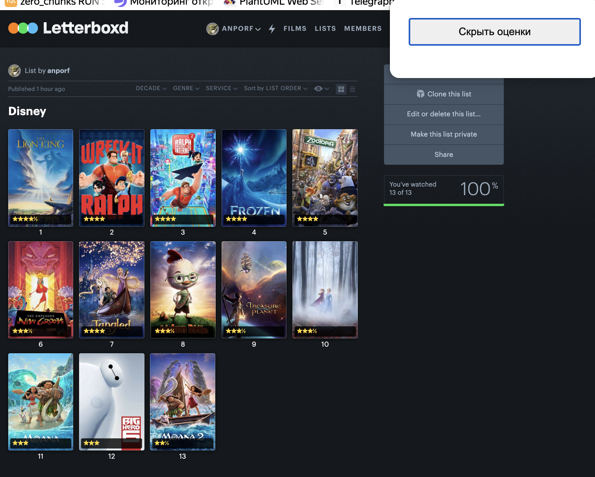

# Letterboxd List Ratings

Расширение для браузера, которое показывает твои оценки прямо на постерах фильмов, когда ты открываешь чей-то список на Letterboxd.

---

## Установка

### Шаг 1 — Скачай расширение

1. Открой страницу репозитория на GitHub
2. Нажми зелёную кнопку **Code** → **Download ZIP**
3. Распакуй скачанный архив

### Шаг 2 — Установи в браузер

Вообще можно загуглить как поставить локальное расширение в ваш браузер. Там ничего сложного вроде как.

**Яндекс Браузер:**
1. В адресной строке `browser://extensions`
2. Включи переключатель **Режим разработчика** (правый верхний угол)
3. Нажми кнопку **Загрузить распакованное расширение**
4. Выбери папку, которую ты распаковал на шаге 1

**Google Chrome:**
1. В адресной строке введи `chrome://extensions`
2. Включить переключатель **Режим разработчика** (правый верхний угол)
3. Нажать кнопку **Загрузить распакованное**
4. Выбрать папку, которую ты распаковал на шаге 1

### Шаг 3 — Готово!

1. Открой любой список, например:
   `https://letterboxd.com/имя_пользователя/list/название-списка/`
2. Твои оценки появятся автоматически на каждом постере

---

## Использование

Нажать на иконку расширения в панели браузера — откроется маленькое окошко с кнопкой **Скрыть / Показать оценки**.

---

## Важно

- Расширение работает **только на страницах списков** (`.../list/...`)
- Ты должен быть **залогинен** на Letterboxd — расширение показывает именно твои оценки
- Никакие данные никуда не отправляются — всё работает локально в браузере

---

> Подробно о том, как устроено расширение внутри — в [TECHNICAL.md](TECHNICAL.md)
